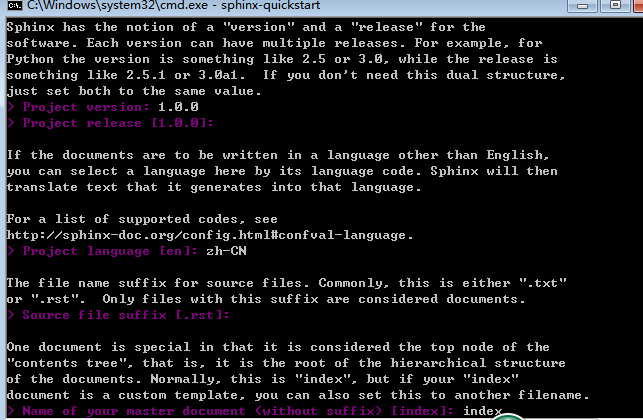

===============
1 配置环境
===============

-----------------------
1.1 安装python
-----------------------

点击 https://www.python.org/downloads/ 进入python官网下载对应电脑系统版本的python（以w7系统64位为例）

 

然后点击“Windows”进入如下界面下载对应的版本
（我下载的是windows 64位的python 2.7.12的版本）如下图：

 
但有python 2与python 3区别（注意：这在Read the docs上导入文档需要选择，如果你本地安装的是python 2，那么你在Read the docs上导入文件要选择CPython 2.0）如下图为Read the Docs导入文档时在高级设置里设置（默认设置为2.0）：

 

下载python安装包解压后一路next，安装好后按如下图操作设置好python的环境变量（我安装在C:/Python27，故在设置添加环境变量path中加入C:/Python27；，注意添加后每个path之间用分号隔开）；
 
 

 

在电脑环境变量里的path中加入：C:/Python27/Scripts；
设置好后打开全局命令行检查python是否安装好；在命令行输入如下命令即可::
 
 Python  

出现以下表示安装成功

 
 
-----------------------
1.2 安装pip
-----------------------

安装好python后接下来打开安装好的python所在目录下的Scripts文件夹，例如下图

 
在C:/Python27/Scripts里打开命令行，执行如下命令安装pip::

 easy_install.exe pip
 
安装好pip后会在此C:/Python27/Scripts目录下看到生成的pip.exe,如下图

 
 
----------------------
1.3 安装Sphinx
----------------------

现在有了python的环境后，可以安装Sphinx啦(采用reStructuredText格式)

此时已有python环境，打开全局命令行可以执行如下::
	
	pip install sphinx sphinx-autobuild 
	
接下来就可以创建项目啦,我在C:/Users/project的project文件下打开命令行，执行以下命令::

	mkdir docs   //在此文件命令下创建docs文件；

	Pip install sphinx  //继续在project文件下执行此命令

	cd docs   //执行此命令打开docs文件

	sphinx-quickstart  //在docs下执行此命令

	
执行完上述命令会出现如下选项，如图：

.. image:: images/18.png
 :width: 644
 :height: 426
 

a)分离source和build目录，方便管理::

 > Separate source and build directories (y/N) [n]: y
 
b)指定工程名、作者名、版本号::

 The project name will occur in several places in the built documentation.
 
 > Project name: Note
 
 > Author name(s): LK
 
 Sphinx has the notion of a "version" and a "release" for the software. Each version can have multiple releases. For example, for Python the version 
 
 is something like 2.5 or 3.0, while the release is something like 2.5.1 or 3.0a1.  If you don't need this dual structure, just set both to the same value.
 
 > Project version: 0.1
 
 > Project release [0.1]:

 
c)文档文件的后缀名，默认是.rst（默认就直接“回车”）::

	The file name suffix for source files. Commonly, this is either ".txt"
	
	or ".rst".  Only files with this suffix are considered documents.
	
	> Source file suffix [.rst]: 
	
d)翻译后如下目录::

 1.文档根目录(Root path for the documentation)，默认为当前目录(.)
 
 2.是否分离文档源代码与生成后的文档(Separate source and build directories): y
 
 3.模板与静态文件存放目录前缀(Name prefix for templates and static dir):_
 
 4.项目名称(Project name) : EvaEngine
 
 5.作者名称(Author name)：AlloVince
 
 6.项目版本(Project version) : 1.0.1
 
 7.文档默认扩展名(Source file suffix) : .rst
 
 8.默认首页文件名(Name of your master document):index
 
 9.是否添加epub目录(Do you want to use the epub builder):n
 
 10.启用autodoc|doctest|intersphinx|todo|coverage|pngmath|ifconfig|viewcode：n
 
 11.生成Makefile (Create Makefile)：y
 
 12.生成windows用命令行(Create Windows command file):y
 
e)在大多数情况下,您可以接受默认值。当它结束的时候,你会有一个索引。最后会生成Sphinx一个文档项目必需的核心文件，包括
	

 

f)如果向导中的所有设置都保存在conf.py中，可以随时调整。文档的主题风格可以在conf.py里设置（如下)::
	
	html_theme = 'alabaster'
	
	html_theme = 'default'
	
	html_theme = 'sphinxdoc'

接下来我们就开始编写文档吧！