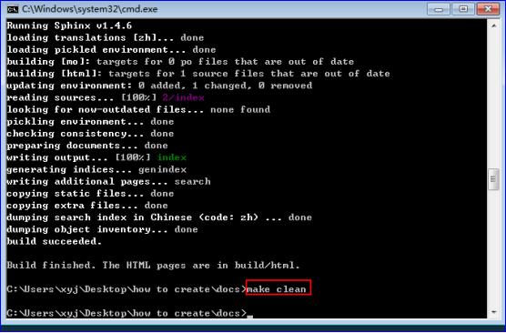
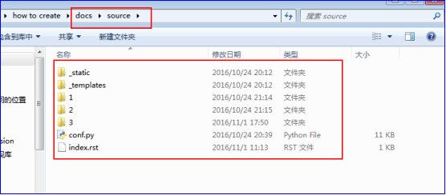
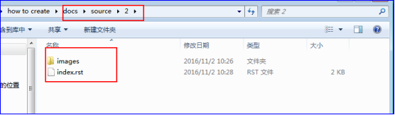

=========================
2 如何编写并编译
=========================

------------------
2.1 编译
------------------

通过命令行打开docs；在此文件内执行如下命令::

 make html

然后在build/html目录下可以手动打开index.html;

(注意：在每次编写完看效果都必须在此文件内执行命令make html,如果上传代码到github上先make html后再执行make clean后再上传代码)

 
-----------------
2.2 编写文档
-----------------

你可以用notepad++来编写source下的index.rst文件；可以安装vim，通过vim编写可以高亮审查格式错误,你也可以选用别的编辑器；

(1)图片创建,手动将图片文件添加到source/_static下，代码如下编写在index.rst中::

 .. image:: _static/image/list.png    
  :width: 211                   
  :height: 112 

或

图片放在对应文件下的images目录下

(2)其它书写格式可参考(可在网上搜索查询格式)

(3)链接：

点击百度网址 http://www.baidu.cn 进入百度::

 点击百度网址 http://www.baidu.cn 进入百度
 
或点击 百度<http://www.baidu.com>::

 百度<http://www.baidu.com>

或点击 百度_
 
.. _百度: http://www.baidu.com

代码如下::

 百度_
 
 .. _百度: http://www.baidu.com

 
(4)上下字体排布

:sub:`您好` 中国::

 :sub:`您好` 中国

:sup:`您好` 中国::
 
 :sup:`您好` 中国
 
(5)其它代码格式请参看如下链接::

reStructuredText的编写格式_

.. _reStructuredText的编写格式: http://blog.useasp.net/archive/2014/09/05/rst-file-restructuredtext-markup-syntax-quikstart.aspx