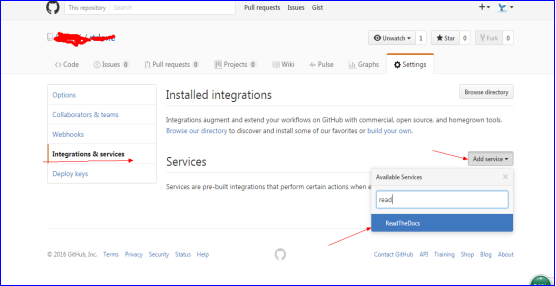
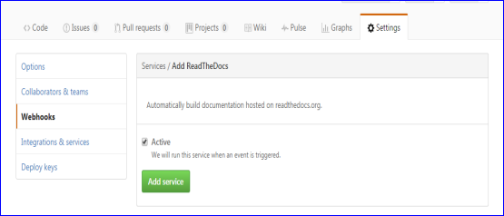
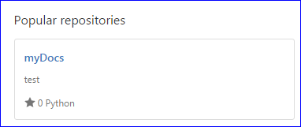
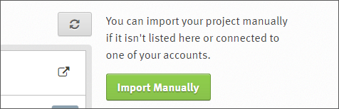
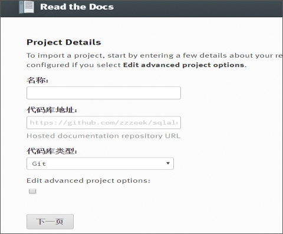
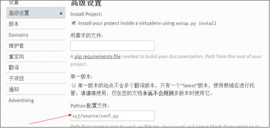
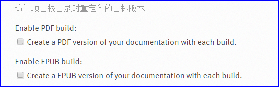
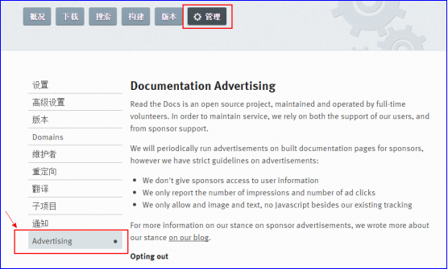

==========================
3 如何上传并托管
==========================

-------------------------------------------
3.1 注册github与Read the docs相关账号
-------------------------------------------

首先，登录 https://github.com ，注册账号，用于上传托管代码；

其次，登录 https://readthedocs.org ，注册账号，用于链接github来托管文档；

-----------------------------
3.2 github上创建项目仓库
-----------------------------

github上创建好项目仓库后需要在存放代码的对应仓库里按如下图进行设置：add service----ReadtheDocs

 

设置好后会自动跳转到如下页面：

--------------------------
3.3 上传代码到github上
--------------------------

上传代码前一定要执行如下命令::

 make clean
 

然后开始上传整个docs文件到github上，执行如下操作::
 
 git init
 
 git add .
 
 git commit -m "first commit"  //再次修改代码上传时引号内的“first commit”需修改不能重复
 
 git remote add origin https://github.com/*****/****Docs.git
 
 git push -u origin master
 

上传成功后会在github上的项目中出现如下python标示；

 
 
---------------------------------------------
3.4 登录Read the Docs,导入文件设置操作
---------------------------------------------

登录Read the docs后在如下界面点击“Import a Project”

 
进入如下界面后，点击绿色按钮“Import Manuallly”：

 
进入如下界面：

 
在如上图中输入名称，代码库地址，勾选后点击“下一页”

创建中会克隆github上面的代码，创建完后点击自己创建好的项目中点击“管理----》高级管理”

 
 
在“高级管理”中填写“docs/source/conf.py”后按“提交”按钮；

 
同时，如下两项不要勾选：

 
 
提交后再进入“管理”界面的“advertising”栏目下：

 
点击如下按钮：

 
导入成功后会出现“passed”，如下图所示：

